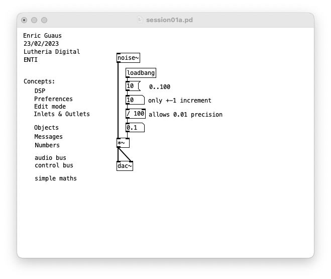
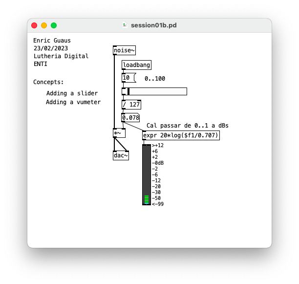

# Introduction to Pure Data

## session01a.pd 

* DSP, Preferences, Edit mode, Inlets and Outlets
* Objects, Messages, Numbers
* Audio bus, Control bud
* Simple maths

## session01b.pd

* Adding a slider
* Adding a vumeter

