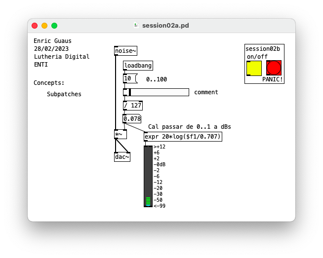
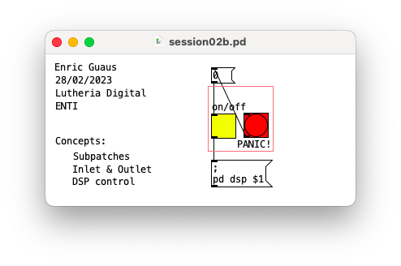
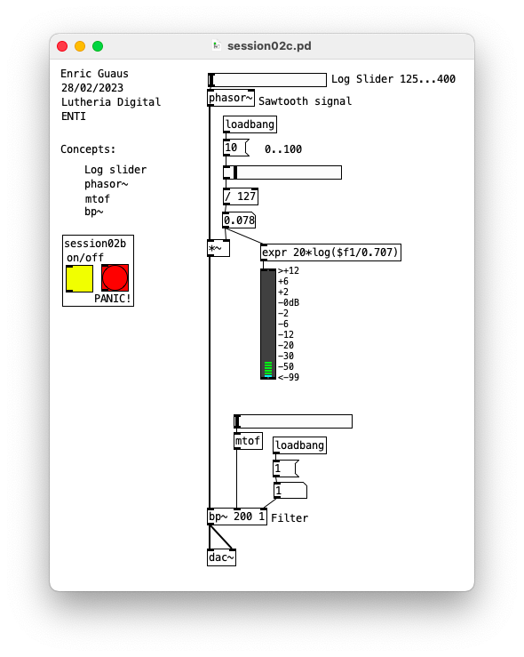
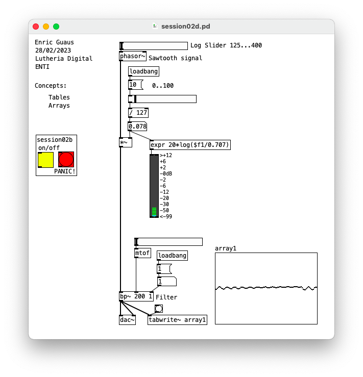
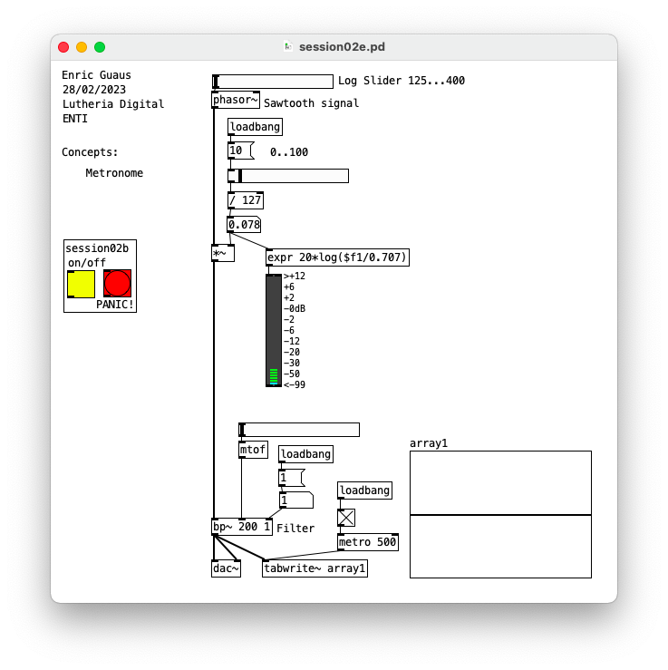
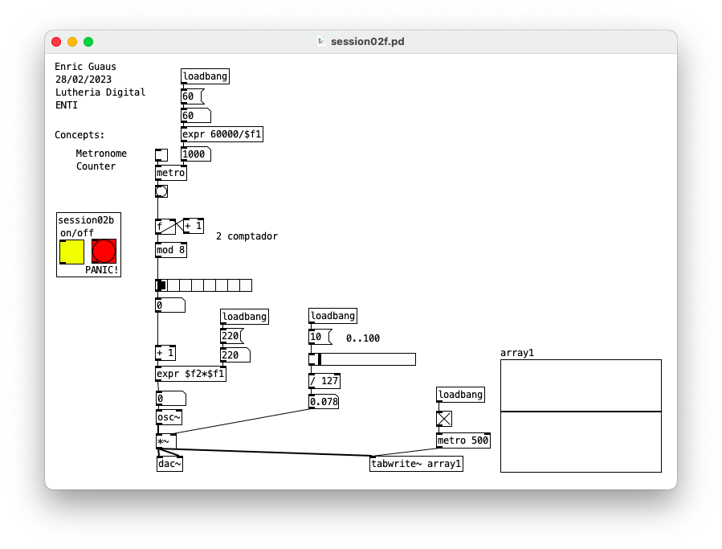

# Session02

First sounds and subpatches

## session02a.pd 

* Subpatches

## session02b.pd 

* Subpatches
* Inlet and Outlet
* DSP Control

## session02c.pd 

* Log Slider
* phasor~
* motf
* bp~

## session02d.pd 

* Tables
* Arrays

## session02e.pd 

* Metronome

## session02f.pd 

* Metronome
* Counter

