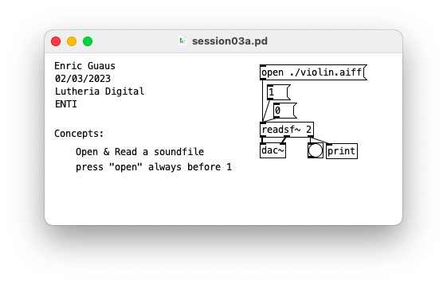
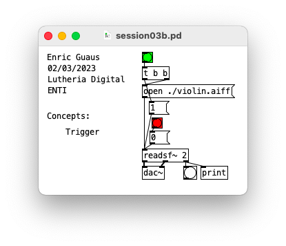
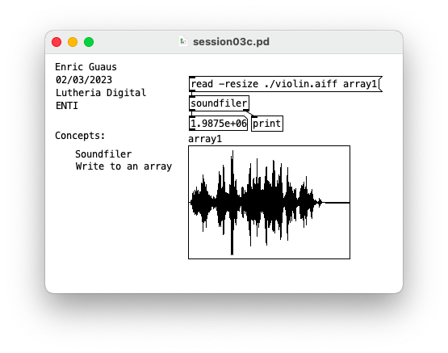
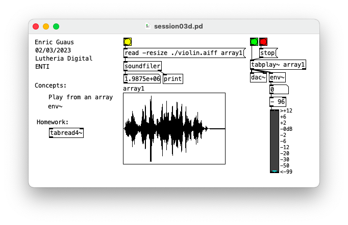

# Playing sound files

## session03a.pd 

* Open and read sound files

## session03b.pd 

* Trigger

## session03c.pd 

* Soundfiler
* Save into an array

## session03d.pd 

* Play from an Array
* Envelope computation: env~

