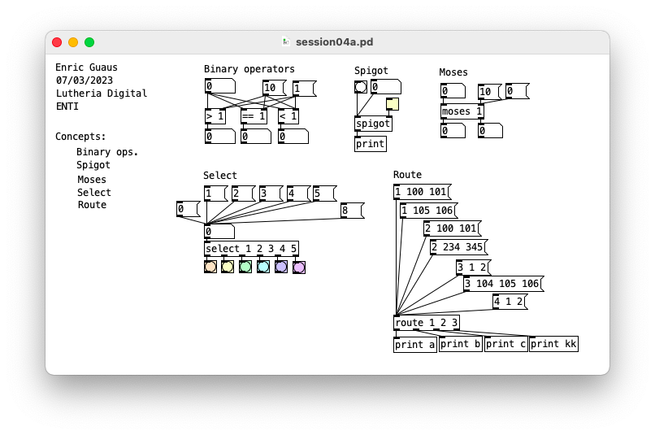
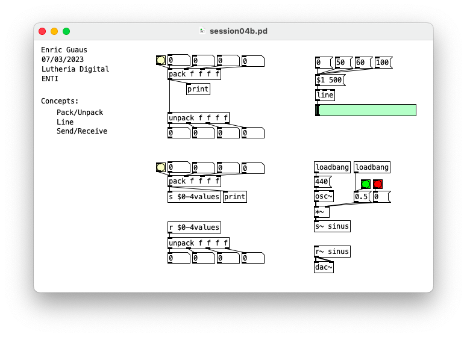
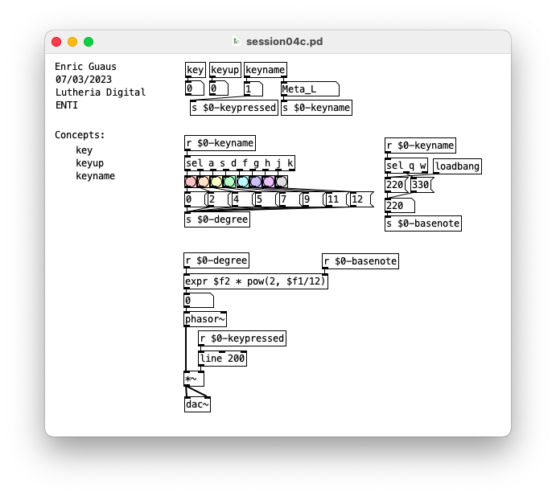

#Session04

Helpers

## session04a.pd 

* Binary operations
* Spigot
* Moses
* Select
* Route

## session04b.pd 

* Pack/unpack
* Line
* Send/receive

## session04c.pd 

* Key, keyup, keyname
* My first keyboard

