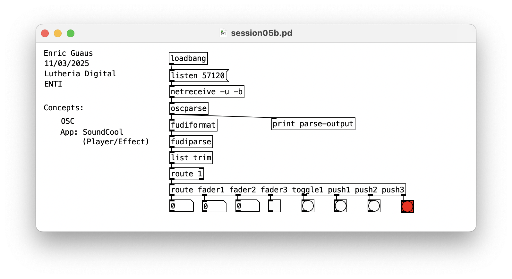

# OSC

## session05a.pd 

* OSC
* App: OSC Controller

## session05b.pd 

* OSC
* Line
* App: OSC Hook

## session05c.pd 

* OSC
* Send and Receive

## Links

* OpenSoundControl.org ([web](https://ccrma.stanford.edu/groups/osc/index.html)).
* UOC ([artículo](https://mosaic.uoc.edu/2019/04/03/introduccion-al-protocolo-de-comunicacion-open-sound-control/)).
* Future Music ([artículo](https://www.futuremusic-es.com/protocolo-open-sound-control-osc-enriquece-produccion-musical/)).

## Apps

* OSCHook v2 (outdated?)
* OSC Controller [Android](https://play.google.com/store/apps/details?id=com.ffsmultimedia.osccontroller&hl=es&gl=US)
* Syntien [OSX](https://apps.apple.com/cr/app/syntien/id1203153534)

## Services

* [Artsmesh](https://www.artsmesh.com/)