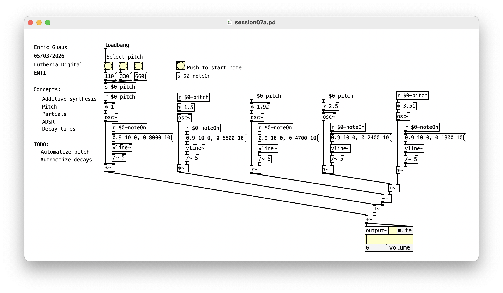
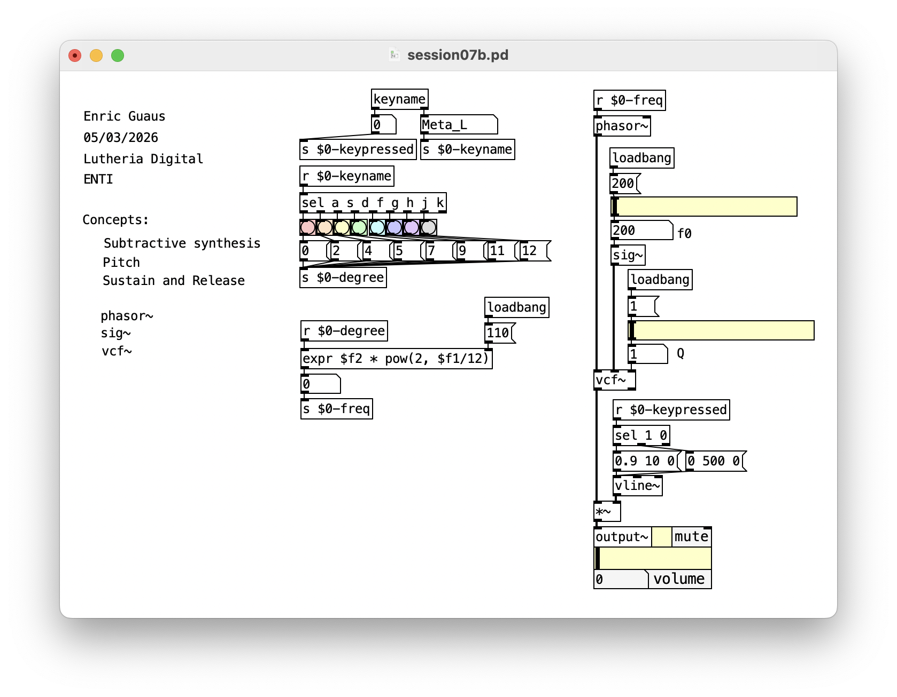

# Synthesis

## session07a.pd 

* Additive synthesis.
* Pitch, partials, ADSR, Decay times.

## session08b.pd 

* Subtractive synthesis
* Pitch
* Sustain and Release

## session07c.pd

* FM synthesis

## TODO

* Add AM, Phase modulation, Wavetable and Granular synthesis. 

