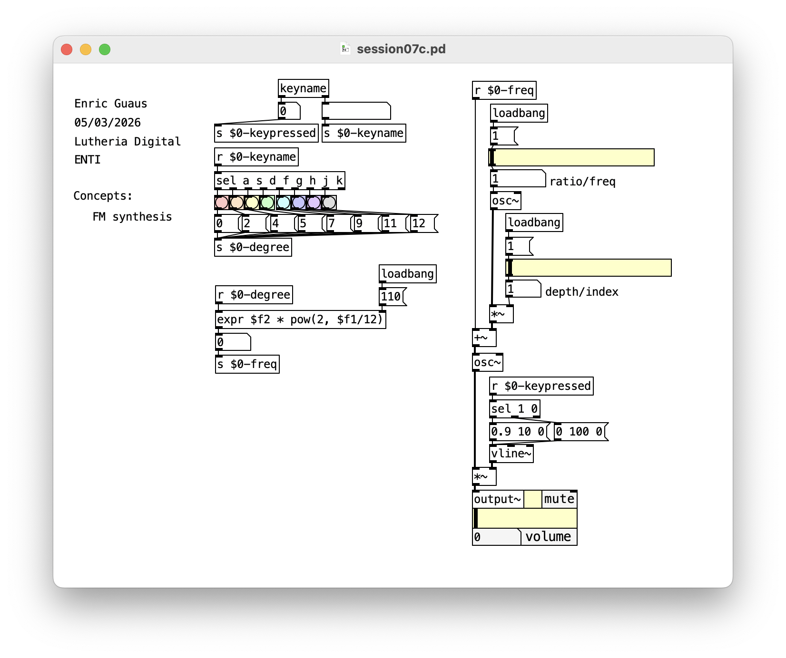

# Synthesis

## session07a.pd 

* Additive synthesis.
* Pitch, partials, ADSR, Decay times.

## session07b.pd 

* Subtractive synthesis
* Pitch
* Sustain and Release

## session07c.pd

* FM synthesis

## Books

* Curtis Roads
The Computer Music Tutorial, second edition
The MIT Press
2023
ISBN: 9780262044912
https://mitpressbookstore.mit.edu/book/9780262044912

* Miller Puckette
The Theory and Technique of Electronic Music
World Scientific Publishing
2007
DOI:10.1142/6277
ISBN: 978-9812700773
https://www.researchgate.net/publication/242020079_The_Theory_and_Technique_of_Electronic_Music

* Andy Farnell
Designing Sound
The MIT Press
2010
ISBN: 9780262014410
https://mitpress.mit.edu/9780262014410/designing-sound/

* Cipriani Alessandro and Giri Maurizio
Electronic Music and Sound Design: Theory and Practice with Max/MSP, Volume 1.
Trans. David Stutz. 
Contemponet
2010
ISBN: 978-88-905484-0-6
https://www.cambridge.org/core/journals/organised-sound/article/abs/cipriani-alessandro-and-giri-maurizio-electronic-music-and-sound-design-theory-and-practice-with-maxmsp-volume-1-trans-david-stutz-rome-contemponet-2010-isbn-9788890548406-italian-version-musica-elettronica-e-sound-design-teoria-e-pratica-con-max-e-msp-isbn-9788890548437/D7E0B37F0C6A8A3E0947EA1977109752

* Scott Wilson (Editor), David Cottle (Editor), Nick Collins (Editor), James McCartney (Foreword by)
The SuperCollider Book
The MIT Press
2011
ISBN: 9780262232692
https://mitpressbookstore.mit.edu/book/9780262232692

## TODO

* Add AM, Phase modulation, Wavetable and Granular synthesis.
