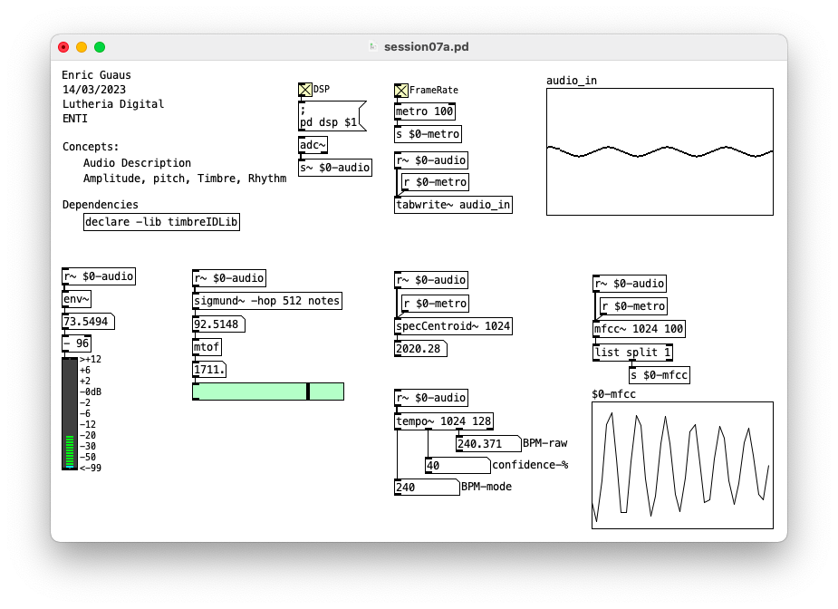
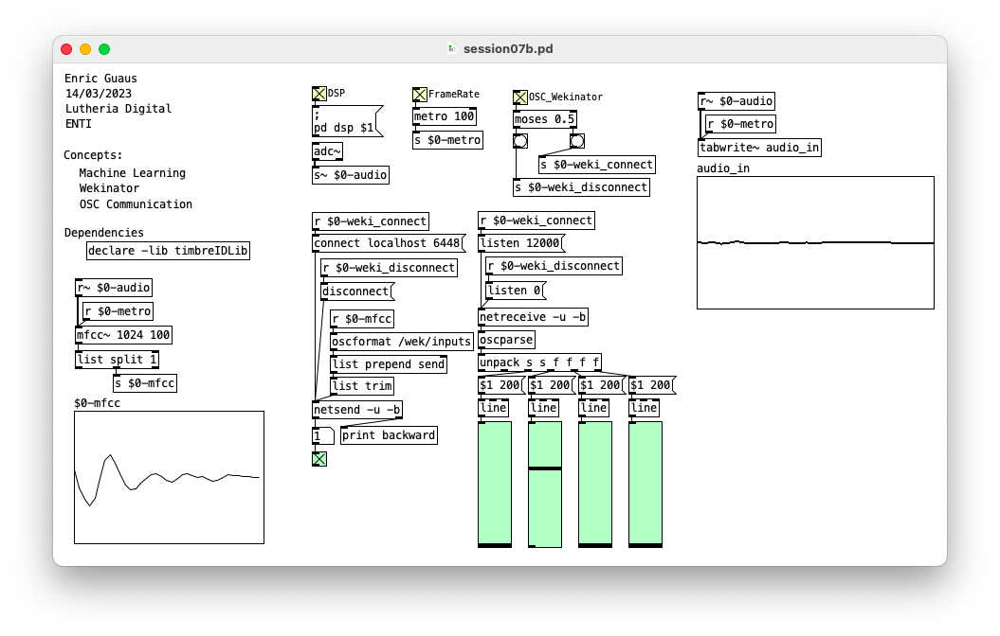

# Machine Learning

## session07a.pd 

* Audio Description
* Amplitude, Pitch, Timbre, Rhythm

## session07b.pd 

* Machine learning
* Wekinator
* OSC COmmunication

## Links

* Pure Data Libraries
 * timbreID ([web](https://github.com/wbrent/timbreIDLib)).
 * ml.lib ([web](https://github.com/irllabs/ml-lib)).
* Wekinator ([web](http://www.wekinator.org/)).
