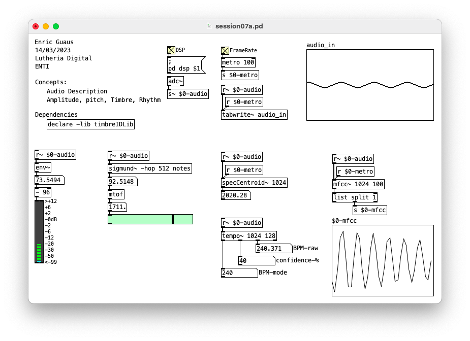
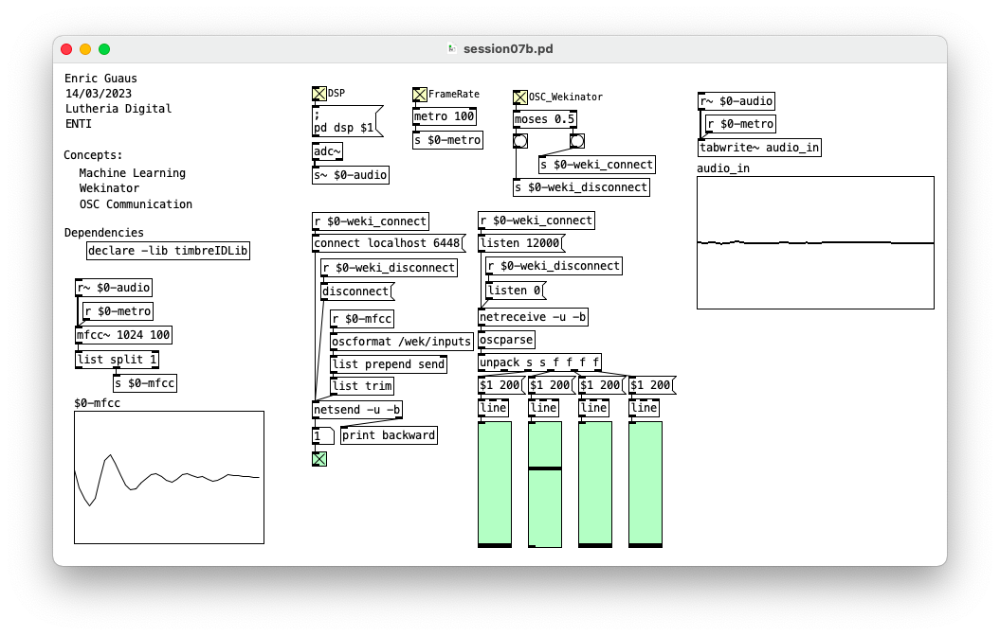
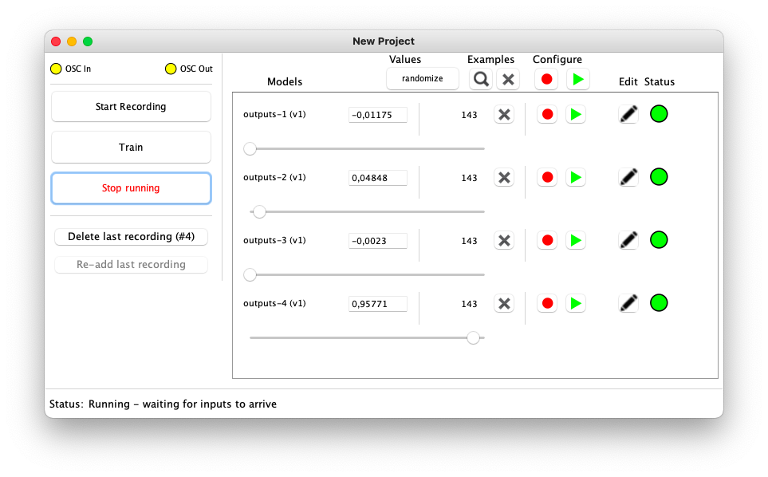

# Machine Learning

## session08a.pd 

* Audio Description.
* Amplitude, Pitch, Timbre, Rhythm.

## session08b.pd 

* Machine learning
* Wekinator
* OSC COmmunication

## Links

* Pure Data Libraries
  * timbreID ([web](https://github.com/wbrent/timbreIDLib)).
  * ml.lib ([web](https://github.com/irllabs/ml-lib)).
* Wekinator ([web](http://www.wekinator.org/)).
